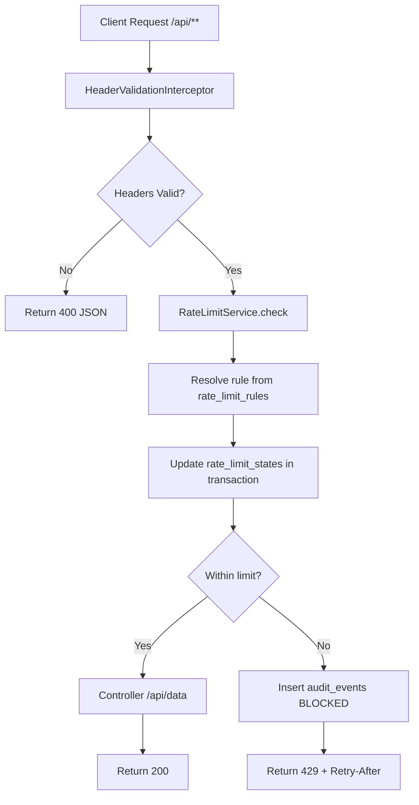

# Rate Limiting Gateway

Spring Boot gateway service that enforces per-tenant/per-key quotas before protected controller logic.

## Table of Contents

- [0. Quick Start (60 Seconds)](#0-quick-start-60-seconds)
- [1. Project Overview](#1-project-overview)
- [2. Assignment Coverage](#2-assignment-coverage)
- [3. System Architecture](#3-system-architecture)
- [4. Rate Limiting Model](#4-rate-limiting-model)
- [5. Data Model](#5-data-model)
- [6. API Reference](#6-api-reference)
- [7. Local Development](#7-local-development)
- [8. Build, Test, and Verification](#8-build-test-and-verification)
- [9. Troubleshooting](#9-troubleshooting)
- [10. Decisions and Tradeoffs](#10-decisions-and-tradeoffs)
- [11. Known Limitations](#11-known-limitations)
- [12. AI Agent & Setup](#12-ai-agent--setup)
- [13. Additional Documentation](#13-additional-documentation)

## 0. Quick Start (60 Seconds)

```bash
./mvnw test
./mvnw package
./mvnw spring-boot:run
```

In a second terminal:

```bash
curl -i http://localhost:8081/api/data -H "X-Tenant-Id: t1" -H "X-Api-Key: k1"
```

Expected: HTTP `200` with JSON body containing `"ok": true`.

## 1. Project Overview

This service protects backend endpoints by enforcing rate limits per request identity tuple:

`(tenantId, apiKey, method, path)`

Protected endpoints:

- `GET /api/data`
- `POST /api/data`

Required request headers:

- `X-Tenant-Id`
- `X-Api-Key`

When a request is blocked, service returns HTTP `429` and stores an audit event in persistent storage.

## 2. Assignment Coverage

| Requirement | Status | Notes |
|---|---|---|
| Protected API with at least two endpoints | Done | `GET /api/data`, `POST /api/data` ([traceability](docs/ASSIGNMENT_TRACEABILITY.md#1-protected-api-and-headers)) |
| Missing headers return `400` JSON | Done | Enforced in interceptor ([traceability](docs/ASSIGNMENT_TRACEABILITY.md#1-protected-api-and-headers)) |
| Rate limiting as middleware/interceptor | Done | `HeaderValidationInterceptor` ([traceability](docs/ASSIGNMENT_TRACEABILITY.md#2-rate-limiting-middleware-and-429-body)) |
| `429` body includes code, rule id, retry | Done | `errorCode`, `ruleId`, `retryAfterSeconds` ([traceability](docs/ASSIGNMENT_TRACEABILITY.md#2-rate-limiting-middleware-and-429-body)) |
| Admin API for quota CRUD | Done | `PUT/GET/DELETE /admin/limits` ([traceability](docs/ASSIGNMENT_TRACEABILITY.md#3-admin-api-for-limits)) |
| Persistence for rules and state | Done | File-based H2 ([traceability](docs/ASSIGNMENT_TRACEABILITY.md#4-persistence-of-rules-state-and-audit)) |
| Local audit for blocked requests | Done | `audit_events` table ([traceability](docs/ASSIGNMENT_TRACEABILITY.md#5-auditing-on-blocked-requests)) |
| Automated tests + E2E script | Done | JUnit + `scripts/e2e.sh` ([traceability](docs/ASSIGNMENT_TRACEABILITY.md#7-testing-and-e2e-script)) |
| S3 export | Optional, not implemented | Not required for pass |

## 3. System Architecture

High-level request flow:

1. Client calls `/api/**` with headers.
2. `HeaderValidationInterceptor` validates required headers.
3. Interceptor calls `RateLimitService.check(...)`.
4. `RateLimitService` resolves best matching rule from DB.
5. Service updates persistent counter state in transaction.
6. If over limit:
- persist audit event (`decision=BLOCKED`)
- return `429` with retry details.
7. If allowed, request reaches controller.

See detailed architecture notes and component responsibilities in `docs/ARCHITECTURE.md`.

Architecture flow diagram:



## 4. Rate Limiting Model

Algorithm: **Fixed Window**.

Rule fields:

- `tenantId`
- `apiKey`
- `method`
- `path`
- `limit`
- `windowSeconds`

Matching supports exact and wildcard (`*`) values for `apiKey`, `method`, and `path`.

Rule selection behavior:

- Filter rules by tenant and wildcard/exact match.
- Choose highest specificity (exact matches outrank wildcard matches).
- If no configured rule matches, fallback default applies: `5 requests / 60 seconds`.

Concurrency behavior:

- Per effective key lock (`tenantId|apiKey|method|path`) prevents over-allow races.
- State update and audit write happen inside the same transaction callback.

## 5. Data Model

Persistent tables (JPA entities):

- `rate_limit_rules`: configurable quota rules.
- `rate_limit_states`: fixed-window counters and window start timestamps.
- `audit_events`: blocked request audit trail.

See table-level field documentation in `docs/ARCHITECTURE.md`.

## 6. API Reference

Full request/response examples are in `docs/API.md`.

Quick summary:

### Endpoint Status Matrix

| Endpoint | Method | Success | Common errors |
|---|---|---|---|
| `/api/data` | `GET` | `200` | `400`, `429` |
| `/api/data` | `POST` | `200` | `400`, `429` |
| `/admin/limits` | `PUT` | `200` | `400`, `404` (id update target missing) |
| `/admin/limits` | `GET` | `200` | `400` |
| `/admin/limits/{id}` | `DELETE` | `204` | `404` |
| `/admin/audit` | `GET` | `200` | `400` (invalid `limit`) |

### Protected endpoints

- `GET /api/data`
- `POST /api/data`

Missing headers:

- Status: `400`
- Body:

```json
{
  "errorCode": "MISSING_HEADER",
  "message": "X-Tenant-Id is required"
}
```

Rate-limited:

- Status: `429`
- Header: `Retry-After: <seconds>`
- Body:

```json
{
  "errorCode": "RATE_LIMITED",
  "ruleId": "12",
  "retryAfterSeconds": 37,
  "message": "Too many requests. Retry after 37 seconds."
}
```

### Admin endpoints

- `PUT /admin/limits`
- `GET /admin/limits?tenantId=...`
- `DELETE /admin/limits/{id}`
- `GET /admin/audit?tenantId=...&limit=...`

## 7. Local Development

Prerequisites:

- Java 17+
- Bash and curl (for E2E scripts)
- On Windows, run E2E scripts via Git Bash or WSL

Start service:

```bash
./mvnw spring-boot:run
```

PowerShell:

```powershell
.\mvnw.cmd spring-boot:run
```

Default port: `8081`.

Database configuration (runtime):

- `spring.datasource.url=jdbc:h2:file:./data/rate-limit-gateway`
- `app.seed-default-rules.enabled=false` (clean startup by default)

This persists rules and counters across restarts.
If you want sample startup rules for local demos, set `app.seed-default-rules.enabled=true`.

## 8. Build, Test, and Verification

Run tests:

```bash
./mvnw test
```

Build artifact:

```bash
./mvnw package
```

Run E2E against existing running service:

```bash
bash scripts/e2e.sh
```

Run managed restart persistence checks:

```bash
MANAGE_APP=1 bash scripts/e2e.sh
```

Dedicated persistence script:

```bash
bash scripts/e2e_persistence.sh
```

See full test strategy in `docs/TESTING.md`.

### Reviewer Quick Verify

Run these commands from repo root:

```bash
./mvnw test
./mvnw package
bash scripts/e2e.sh
MANAGE_APP=1 bash scripts/e2e.sh
bash scripts/e2e_persistence.sh
```

Expected result:

- Maven commands finish with `BUILD SUCCESS`
- E2E scripts print final success messages and exit with code `0`

## 9. Troubleshooting

### `Cannot start maven from wrapper`

Cause: missing `.mvn/wrapper/maven-wrapper.properties`.

Fix:

- ensure file exists with valid `distributionUrl`.

### Port already in use

If `8081` is busy, run:

```bash
./mvnw spring-boot:run -Dspring-boot.run.arguments=--server.port=18081
```

### E2E script fails with service unavailable

- Verify app is running and reachable at `BASE_URL`.
- If using managed mode, ensure built jar exists in `target/`.
- On Windows, run scripts from Git Bash/WSL so `bash` and Unix tools are available.

## 10. Decisions and Tradeoffs

### Rate limiting algorithm

Chosen: **Fixed Window**

Why:

- deterministic and easy to test
- clear persistence model for counters
- sufficient for assignment scope

Tradeoff:

- allows burst near window boundaries (known fixed-window property)

### S3 export

Not implemented. This is optional in assignment. Local audit persistence is fully implemented.

### Script validation approach

Chosen: `curl -s -o /dev/null -w "%{http_code}"`

Why:

- simple deterministic checks
- shell-friendly, CI-friendly, easy fail-fast behavior

## 11. Known Limitations

- Fixed-window algorithm allows boundary bursts around window rollover.
- Rate-limit state is backed by local DB; this is not a multi-node distributed limiter design.
- Admin endpoints are intentionally unauthenticated (assignment scope excludes auth).
- Optional S3 export is not implemented.

## 12. AI Agent & Setup

Agent/tool:

- OpenAI Codex coding agent (GPT-5 based) in terminal workflow

Local setup:

- OS: Windows (PowerShell)
- Java: 17 (Temurin)
- Build tool: Maven Wrapper (`mvnw` / `mvnw.cmd`)

Working style:

- iterative implementation and verification
- frequent `mvnw test` runs
- targeted E2E checks with curl scripts
- defect-fix loops based on test feedback

Representative command loop:

```bash
./mvnw test
./mvnw -Dtest=RateLimitWildcardAndConcurrencyTests test
./mvnw package
bash scripts/e2e.sh
MANAGE_APP=1 bash scripts/e2e.sh
bash scripts/e2e_persistence.sh
```

### Latest Verification Snapshot

Most recent local verification was run on **February 10, 2026**:

- `.\mvnw.cmd test` -> passed (`Tests run: 6, Failures: 0, Errors: 0`)
- `.\mvnw.cmd package` -> passed (`BUILD SUCCESS`)
- Repository revision: unavailable in this workspace (no `.git` directory detected).

## 13. Additional Documentation

- `docs/ARCHITECTURE.md` - components, flow, persistence model, constraints
- `docs/API.md` - endpoint-by-endpoint reference and examples
- `docs/OPERATIONS.md` - runbook, env vars, restart and deployment notes
- `docs/TESTING.md` - test catalog and verification strategy
- `docs/ASSIGNMENT_TRACEABILITY.md` - explicit mapping from assignment clauses to implementation
