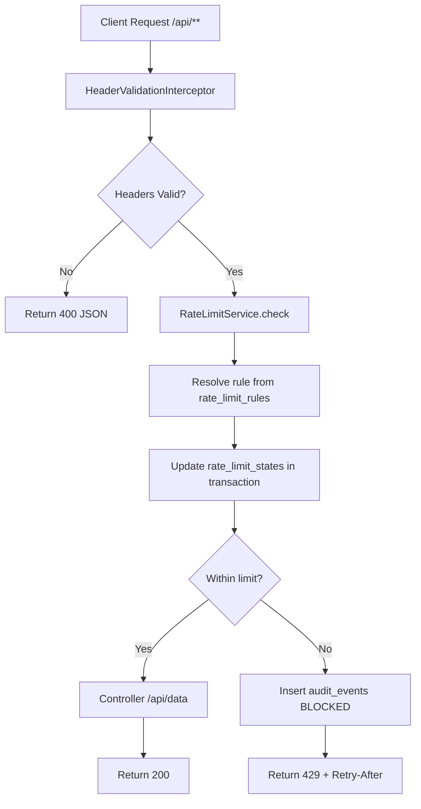

# Architecture

## 0. Flow Diagram

## 1. Components

- `HeaderValidationInterceptor`
- `RateLimitService`
- `AdminLimitsController`
- `AdminAuditController`
- JPA repositories for rules, state, and audit
- H2 persistent storage

## 2. Request Processing

### 2.1 Protected requests (`/api/**`)

1. Interceptor validates `X-Tenant-Id` and `X-Api-Key`.
2. Interceptor invokes `RateLimitService.check(...)`.
3. Service resolves rule by tenant + wildcard/exact match.
4. Service updates `rate_limit_states` counter.
5. If blocked:
- service writes `audit_events` row
- interceptor returns `429` with JSON + `Retry-After`.
6. If allowed: controller executes and returns payload.

### 2.2 Admin requests

- Admin APIs bypass rate-limit interceptor because interceptor is registered only for `/api/**`.

## 3. Rule Resolution Logic

Match candidates:

- tenant must match exactly
- each dimension (`apiKey`, `method`, `path`) matches if exact or `*`

Specificity score:

- `+1` for exact apiKey
- `+1` for exact method
- `+1` for exact path

Highest score wins. If no match, default rule applies.

## 4. Fixed Window State Model

State key:

`(tenant_id, api_key, http_method, path)`

State fields:

- `window_start_epoch_seconds`
- `request_count`

Logic:

- if `now >= window_start + windowSeconds`, open new window with count `1`
- else increment count
- allowed when `request_count <= limit`
- blocked otherwise with retry `window_end - now`

## 5. Transactional Behavior

Rate-limit decision uses `TransactionTemplate`.

Within same transaction callback:

- state row is written/updated
- blocked audit row is inserted when over-limit

This satisfies assignment requirement that if `429` is returned, corresponding audit exists.

## 6. Concurrency Controls

`ConcurrentHashMap<String, Object> keyLocks` provides per-effective-key lock.

Lock scope includes DB read + update + decision, preventing over-allow under concurrent access for same key tuple.

## 7. Persistence Tables

## 7.1 `rate_limit_rules`

- `id` (PK)
- `tenant_id`
- `api_key`
- `http_method`
- `path`
- `limit_value`
- `window_seconds`

Unique constraint:

- `(tenant_id, api_key, http_method, path)`

## 7.2 `rate_limit_states`

- `id` (PK)
- `tenant_id`
- `api_key`
- `http_method`
- `path`
- `window_start_epoch_seconds`
- `request_count`

Unique constraint:

- `(tenant_id, api_key, http_method, path)`

## 7.3 `audit_events`

- `id` (PK)
- `event_timestamp_utc`
- `tenant_id`
- `api_key`
- `http_method`
- `path`
- `rule_id`
- `client_ip`
- `decision`
- `retry_after_seconds`
- `window_seconds`
- `request_count`

## 8. Non-goals and Optional Items

- S3 audit export is not implemented (optional by assignment).
- Authentication/authorization for admin APIs is out of scope.
